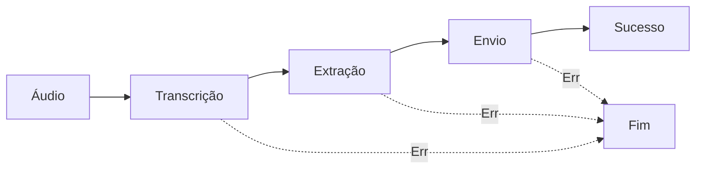

# 🤖 Organizze Telegram Bot

> Bot inteligente do Telegram que registra seus gastos no Organizze através de comandos de voz usando IA

[](https://www.python.org/downloads/)
[](https://openai.com/)
[](https://core.telegram.org/bots)
[](LICENSE)

## 📋 Índice

- [Sobre](#-sobre)
- [Demonstração](#-demonstração)
- [Funcionalidades](#-funcionalidades)
- [Arquitetura](#-arquitetura)
- [Pré-requisitos](#-pré-requisitos)
- [Instalação](#-instalação)
- [Configuração](#-configuração)
- [Uso](#-uso)
- [Estrutura do Projeto](#-estrutura-do-projeto)
- [Testes](#-testes)
- [Deploy](#-deploy)
- [Contribuindo](#-contribuindo)
- [Licença](#-licença)

## 🎯 Sobre

O **Organizze Telegram Bot** é uma aplicação que utiliza inteligência artificial para facilitar o registro de gastos no [Organizze](https://www.organizze.com.br/). Basta enviar um áudio para o bot descrevendo seu gasto, e ele automaticamente:

1. 🎧 **Transcreve** o áudio usando Whisper (OpenAI)
2. 🧠 **Extrai** informações estruturadas com GPT-4 (valor, descrição, data, tags)
3. 💾 **Registra** a transação na sua conta Organizze
4. ✅ **Confirma** o registro com feedback detalhado

## 🎬 Demonstração

```
Você: 🎤 [áudio] "Gastei cinquenta reais no supermercado hoje"

Bot: 🎧 Processando seu áudio...

     ✅ Transcrição: Gastei cinquenta reais no supermercado hoje

     ✅ Dados extraídos:
     💰 R$ 50,00
     📝 Supermercado
     📅 2025-11-13

     ✅ Gasto registrado no Organizze!
```

## ✨ Funcionalidades

### 🎯 Principais

- ✅ **Reconhecimento de Voz**: Aceita mensagens de voz e arquivos de áudio
- ✅ **Extração Inteligente**: IA identifica valor, descrição, data e categorias automaticamente
- ✅ **Processamento Natural**: Entende português brasileiro coloquial
- ✅ **Tags Automáticas**: Categoriza gastos (alimentação, transporte, lazer, etc)
- ✅ **Validação de Dados**: Verifica e formata informações antes de enviar
- ✅ **Feedback Detalhado**: Mostra cada etapa do processamento

### 🔧 Técnicas

- 🏗️ **LangGraph**: Workflow modular e rastreável
- 🎨 **Arquitetura Limpa**: Separação de responsabilidades
- 📝 **Type Hints**: Código totalmente tipado
- 🧪 **Testável**: Componentes isolados e mockáveis
- 🔒 **Seguro**: Variáveis sensíveis em `.env`
- 📊 **Logging**: Rastreamento completo de operações

## 🏗️ Arquitetura

O bot utiliza um workflow baseado em LangGraph com três nós principais:



### Componentes

- **Bot Handler**: Recebe mensagens do Telegram
- **Transcription Service**: Converte áudio em texto (Whisper)
- **Extraction Service**: Extrai dados estruturados (GPT-4)
- **Organizze Client**: Comunica com a API do Organizze
- **LangGraph Workflow**: Orquestra todo o fluxo

## 📦 Pré-requisitos

- Python 3.9 ou superior
- Conta no [Telegram](https://telegram.org/)
- Conta no [Organizze](https://www.organizze.com.br/)
- API Key da [OpenAI](https://platform.openai.com/)

## 🚀 Instalação

### 1. Clone o Repositório

```bash
git clone https://github.com/seu-usuario/organizze-telegram-bot.git
cd organizze-telegram-bot
```

### 2. Crie um Ambiente Virtual

```bash
python -m venv venv

# Linux/Mac
source venv/bin/activate

# Windows
venv\Scripts\activate
```

### 3. Instale as Dependências

```bash
pip install -r requirements.txt
```

## ⚙️ Configuração

### 1. Crie o Bot no Telegram

1. Abra o Telegram e busque por [@BotFather](https://t.me/botfather)
2. Envie o comando `/newbot`
3. Siga as instruções e escolha um nome e username
4. Copie o **token** fornecido

### 2. Obtenha as Credenciais do Organizze

1. Acesse [Organizze](https://www.organizze.com.br/)
2. Faça login na sua conta
3. Vá em **Configurações** → **API**
4. Copie seu **email** e **token de acesso**

📖 **Documentação da API**: https://github.com/organizze/api-doc

### 3. Obtenha a API Key da OpenAI

1. Acesse [OpenAI Platform](https://platform.openai.com/)
2. Crie uma conta ou faça login
3. Vá em **API Keys** e crie uma nova chave
4. Copie a chave gerada

### 4. Configure as Variáveis de Ambiente

Crie um arquivo `.env` na raiz do projeto:

```bash
cp .env.example .env
```

Edite o arquivo `.env` com suas credenciais:

```bash
# Telegram
TELEGRAM_BOT_TOKEN=123456789:ABCdefGHIjklMNOpqrsTUVwxyz

# OpenAI
OPENAI_API_KEY=sk-proj-xxxxxxxxxxxxxxxxxxxxxxxx

# Organizze
ORGANIZZE_EMAIL=seu_email@example.com
ORGANIZZE_TOKEN=seu_token_organizze_aqui
```

## 🎮 Uso

### Iniciar o Bot

```bash
python main.py
```

Você verá a mensagem:
```
🤖 Bot iniciado!
```

### Comandos Disponíveis

| Comando | Descrição |
|---------|-----------|
| `/start` | Inicia o bot e mostra instruções |

### Exemplos de Uso

#### 📱 Envie um áudio com:

**Simples:**
```
"Gastei cinquenta reais no mercado"
```

**Com data:**
```
"Paguei cento e vinte reais de academia dia quinze"
```

**Com detalhes:**
```
"Gastei trinta e cinco no Uber ontem à noite"
```

**Com forma de pagamento:**
```
"Almoço de quarenta e cinco reais pago no cartão"
```

#### 🤖 O bot responderá:

```
✅ Transcrição: Gastei cinquenta reais no mercado

✅ Dados extraídos:
💰 R$ 50,00
📝 Mercado
📅 2025-11-13

✅ Gasto registrado no Organizze!
```

## 📁 Estrutura do Projeto

```
organizze-telegram-bot/
│
├── src/
│   ├── bot/
│   │   ├── handlers.py          # Handlers do Telegram
│   │   └── messages.py          # Templates de mensagens
│   │
│   ├── graph/
│   │   ├── workflow.py          # Definição do LangGraph
│   │   ├── nodes.py             # Nós do grafo
│   │   └── state.py             # Estado do grafo
│   │
│   ├── services/
│   │   ├── transcription.py    # Serviço de transcrição
│   │   ├── extraction.py       # Extração com LLM
│   │   └── organizze.py        # Cliente da API
│   │
│   ├── models/
│   │   └── expense.py          # Modelos de dados
│   │
│   └── config/
│       └── settings.py         # Configurações
│
├── tests/                       # Testes unitários
├── data/audios/                 # Áudios temporários
├── .env                         # Variáveis de ambiente
├── .gitignore
├── requirements.txt
├── main.py                      # Ponto de entrada
└── README.md
```

## 🧪 Testes

### Executar Todos os Testes

```bash
pytest
```

### Executar Testes Específicos

```bash
pytest tests/test_extraction.py
```

### Cobertura de Código

```bash
pytest --cov=src tests/
```

### Exemplo de Teste

```python
# tests/test_extraction.py
from src.services.extraction import ExtractionService

def test_extract_simple_expense():
    service = ExtractionService()
    result = service.extract("Gastei 50 reais no mercado")
    
    assert result.amount_cents == -5000
    assert "mercado" in result.description.lower()
    assert result.date is not None
```

## 🐳 Deploy

### Docker

**Dockerfile**
```dockerfile
FROM python:3.11-slim

WORKDIR /app

COPY requirements.txt .
RUN pip install --no-cache-dir -r requirements.txt

COPY . .

CMD ["python", "main.py"]
```

**docker-compose.yml**
```yaml
version: '3.8'

services:
  bot:
    build: .
    env_file: .env
    volumes:
      - ./data:/app/data
    restart: unless-stopped
```

**Executar:**
```bash
docker-compose up -d
```

### Servidor (PM2)

```bash
# Instalar PM2
npm install -g pm2

# Iniciar bot
pm2 start main.py --name organizze-bot --interpreter python3

# Ver logs
pm2 logs organizze-bot

# Reiniciar
pm2 restart organizze-bot
```

### Heroku

```bash
# Login
heroku login

# Criar app
heroku create seu-bot-organizze

# Configurar variáveis
heroku config:set TELEGRAM_BOT_TOKEN=xxx
heroku config:set OPENAI_API_KEY=xxx
heroku config:set ORGANIZZE_EMAIL=xxx
heroku config:set ORGANIZZE_TOKEN=xxx

# Deploy
git push heroku main
```

## 🛠️ Desenvolvimento

### Adicionar Novo Comando

1. Crie o handler em `src/bot/handlers.py`:
```python
async def balance_handler(update: Update, context: ContextTypes.DEFAULT_TYPE):
    # Sua lógica aqui
    pass
```

2. Registre em `main.py`:
```python
application.add_handler(CommandHandler("balance", balance_handler))
```

### Adicionar Nova Extração

Modifique `src/services/extraction.py` para adicionar novos campos ou lógica.

### Adicionar Novo Serviço

Crie um novo arquivo em `src/services/` seguindo o padrão dos existentes.

## 🤝 Contribuindo

Contribuições são bem-vindas! Siga estes passos:

1. Fork o projeto
2. Crie uma branch para sua feature (`git checkout -b feature/NovaFeature`)
3. Commit suas mudanças (`git commit -m 'Adiciona nova feature'`)
4. Push para a branch (`git push origin feature/NovaFeature`)
5. Abra um Pull Request

### Diretrizes

- Mantenha o código limpo e bem documentado
- Adicione testes para novas funcionalidades
- Siga o PEP 8 (use `black` e `flake8`)
- Atualize a documentação quando necessário

## 🐛 Problemas Conhecidos

- Áudios muito longos (>5min) podem falhar na transcrição
- Valores com centavos precisam ser falados ("dez reais e cinquenta centavos")
- Datas relativas além de ontem/hoje podem não ser interpretadas corretamente

## 🗺️ Roadmap

- [ ] Suporte a receitas (não apenas despesas)
- [ ] Consultar saldo e extrato
- [ ] Múltiplos idiomas
- [ ] Interface web para configuração
- [ ] Estatísticas e relatórios
- [ ] Integração com outras plataformas financeiras
- [ ] Comandos de texto (não apenas áudio)
- [ ] Reconhecimento de fotos de notas fiscais

## 📚 Recursos Úteis

- [Documentação API Organizze](https://github.com/organizze/api-doc)
- [Telegram Bot API](https://core.telegram.org/bots/api)
- [OpenAI API](https://platform.openai.com/docs)
- [LangGraph](https://langchain-ai.github.io/langgraph/)

## 💬 Suporte

Encontrou um bug? Tem uma sugestão?

- 🐛 [Reportar Bug](https://github.com/seu-usuario/organizze-telegram-bot/issues)
- 💡 [Solicitar Feature](https://github.com/seu-usuario/organizze-telegram-bot/issues)
- 📧 Email: seu-email@example.com

## 📄 Licença

Este projeto está sob a licença MIT. Veja o arquivo [LICENSE](LICENSE) para mais detalhes.

## 👨‍💻 Autor

**Seu Nome**

- GitHub: [@seu-usuario](https://github.com/seu-usuario)
- LinkedIn: [Seu Perfil](https://linkedin.com/in/seu-perfil)
- Email: seu-email@example.com

## 🙏 Agradecimentos

- [Organizze](https://www.organizze.com.br/) pela API aberta
- [OpenAI](https://openai.com/) pelos modelos de IA
- [Telegram](https://telegram.org/) pela plataforma de bots
- Comunidade Python e Open Source

---

<div align="center">

**⭐ Se este projeto foi útil, considere dar uma estrela! ⭐**

Feito com ❤️ e ☕

</div>